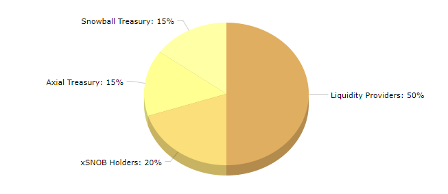

# AXIAL

The AXIAL token is Axial's governance token. 50% of its supply is used as incentives for those providing liquidity in our liquidity pools. It can be used to acquire [**sAXIAL**](saxial.md) or [**veAXIAL**](veaxial.md).

**Ticker:** AXIAL

**Max Supply:** 365,000,000

**Token Address:** [0xcF8419A615c57511807236751c0AF38Db4ba3351](https://snowtrace.io/token/0xcF8419A615c57511807236751c0AF38Db4ba3351)

**Chain:** Avalanche C-Chain

## Token Distribution

## Emission Schedule

There is a total max supply of 365 million AXIAL tokens. These tokens are currently being emitted on a per-second basis, through the following schedule:



| Time (Months) | AXIAL /second |
| ------------- | ------------- |
| Launch        | 10            |
| Month 1       | 8.72          |
| Month 2       | 7.71          |
| Month 3       | 6.35          |
| Month 4       | 5.59          |
| Month 5       | 5.08          |
| Month 6       | 4.73          |
| Month 7       | 4.45          |
| Month 8       | 4.24          |
| Month 9       | 4.06          |
| Month 10      | 3.91          |
| Month 11      | 3.79          |
| Month 12      | 3.68          |
| Month 13      | 3.58          |
| Month 14      | 3.5           |
| Month 15      | 3.42          |
| Month 16      | 3.36          |
| Month 17      | 3.29          |
| Month 18      | 3.24          |
| Month 19      | 3.19          |
| Month 20      | 3.14          |
| Month 21      | 3.1           |
| Month 22      | 3.05          |
| Month 23      | 3.02          |
| Month 24      | 2.98          |
| Month 25      | 2.95          |
| Month 26      | 2.92          |
| Month 27      | 2.89          |
| Month 28      | 2.86          |
| Month 29      | 2.83          |
| Month 30      | 2.81          |
| Month 31      | 2.78          |
| Month 32      | 2.76          |
| Month 33      | 2.25          |
| Month 34      | 2             |
| Month 35      | 0.75          |
| Month 36      | 0             |















## Earning AXIAL

AXIAL is earned by providing liquidity on Axial's many liquidity pools, as well as participating in governance through Snowball's staking of SNOB tokens.

The AXIAL token can also be purchased on the following exchanges:

* [**Trader Joe**](https://analytics.traderjoexyz.com/tokens/0xcF8419A615c57511807236751c0AF38Db4ba3351)
* [**Pangolin**](https://info.pangolin.exchange/#/token/0xcF8419A615c57511807236751c0AF38Db4ba3351)

## AXIAL Resources


[saxial.md](saxial.md)



[veaxial.md](veaxial.md)



[general-faq.md](../faq/general-faq.md)



[axial-contracts.md](../smart-contracts/axial-contracts.md)

