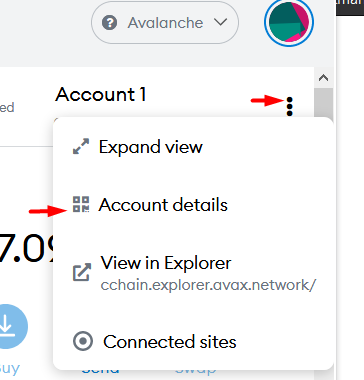

# Funding Your Wallet

This guide provides one of the many ways to fund your wallet on the Avalanche network. This method avoids using the bridge due to reports of issues and delays in fund transfers through the bridge.

In this guide, we are going to directly send AVAX tokens to the Avalanche X-Chain, bypassing the Ethereum Mainnet entirely.

_Note that this guide will require purchasing AVAX on a centralized exchange. For those who do not want to do this, the usage of a bridge from Ethereum or another chain is necessary._

## 1) MetaMask Setup

If you don't have MetaMask, install it [**here**](https://metamask.io/download).

#### Create a Wallet or Import an Existing Wallet

This is where you will create or import an existing Ethereum wallet. If you don’t have an existing Ethereum wallet, select "Create a Wallet." Always keep your password, seed phrase and private key to yourself and make sure to write it down. If you lose all three, you may not be able to access your funds. **Note: This is the wallet that will be used to conduct transactions on Avalanche.**

#### Connect Metamask to Avalanche

Click the drop-down menu and select "Custom RPC":

Enter the following settings into their respective fields:

* **Network Name**: Avalanche Network
* **New RPC URL**: https://api.avax.network/ext/bc/C/rpc
* **ChainID**: 0xa86a
* **Symbol**: AVAX
* **Explorer**: https://snowtrace.io/

#### Add the SNOB Token (Optional)

1\) Select "Add Token":

2\) Select "Custom Token":

3\) Enter the following information:

**Token Contract Address:** 0xc38f41a296a4493ff429f1238e030924a1542e50


The rest of the fields should auto-complete. If not, enter SNOB and 18 for the remaining fields.


4\) Select "Next"

You should now have the AVAX (the native token of Avalanche) and SNOB tokens setup for being displayed on your MetaMask wallet. Now we can proceed to buy some AVAX and transfer it to your wallet.

## 2) Avalanche Wallet Setup

AVAX tokens exist on the Avalanche X-Chain, where they can be traded; on the P-Chain, where they can be staked; and on the C-Chain, where they can be used in smart contracts or to pay for [_**gas**_](https://snowballs.gitbook.io/snowball-docs/resources/defi-glossary#gas) fees.

To find your Avalanche X-Chain address, we are going to access it through Avalanche's native tool; Avalanche Wallet.

Navigate to [**https://wallet.avax.network/access**](https://wallet.avax.network/access)

#### Access Your Wallet

You can access your wallet using your private key, seed phrase, keystore file, or through your Ledger hardware wallet.

You can find your private key on MetaMask.

.png>)

After you have successfully accessed your wallet through Avalanche Wallet, you will see your balance, portfolio and various other useful information.

.png>)

#### Copy Your X-Chain Address

You can use this address in order to send AVAX from an exchange to your wallet.

Some relevant articles on how to withdraw from some of the most popular exchanges:

* [**https://medium.com/avalancheavax/avalanche-avax-can-now-be-purchased-using-a-debit-or-credit-card-via-simplex-c54a4c7fda30**](https://medium.com/avalancheavax/avalanche-avax-can-now-be-purchased-using-a-debit-or-credit-card-via-simplex-c54a4c7fda30)
* [**https://academy.binance.com/en/articles/how-to-withdraw**](https://academy.binance.com/en/articles/how-to-withdraw)
* [**https://support.kraken.com/hc/en-us/articles/360000672763-How-to-withdraw-cryptocurrencies-from-your-Kraken-account**](https://support.kraken.com/hc/en-us/articles/360000672763-How-to-withdraw-cryptocurrencies-from-your-Kraken-account)

_For U.S. residents, you can use the _[_**OKcoin**_](https://www.okcoin.com)_ exchange to buy AVAX._

#### Transferring from X-Chain to C-Chain

Once you send your AVAX tokens from your exchange, they should show up on your X-Chain wallet address through Avalanche Wallet. We are going to move them to your C-Chain wallet address so that it is visible and usable from your MetaMask wallet.

Click on **Cross Chain** on the left. You will be presented with a choice for **Source Chain** and **Destination Chain**. Select X-Chain and C-Chain, respectively. You will see your X-Chain and C-Chain balances, and an input field for entering the amount to transfer from the source chain to the destination chain.

.png>)

After entering the amount you want to transfer, simply click **CONFIRM**.

**Congratulations!** As soon as the transaction is confirmed, your tokens should be visible on MetaMask. Now you can engage with smart contracts on the Avalanche C-Chain. Go get those Snowballs!
