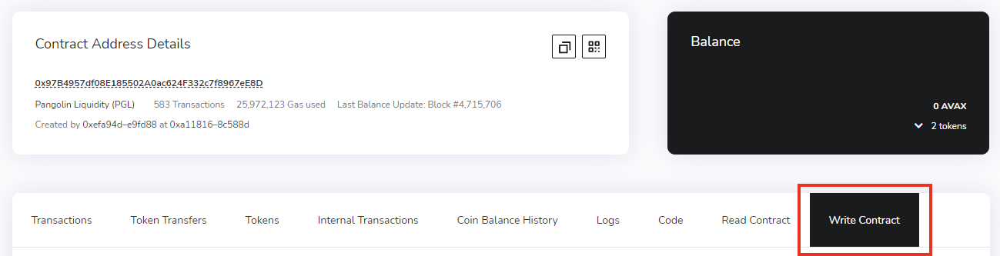
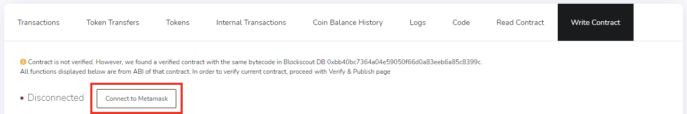
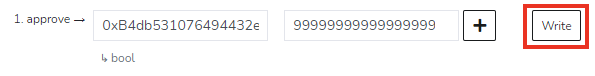
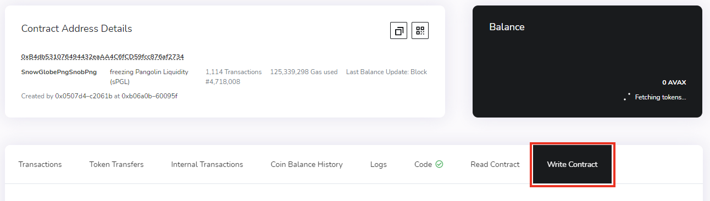
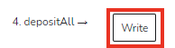
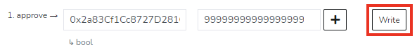
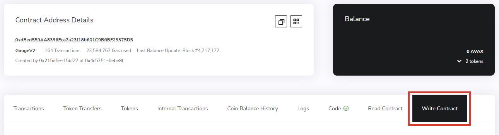
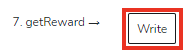
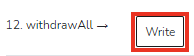

# Manual Smart-Contract Interaction

In the rare case something happens to Snowball's website, you can always interact with our contracts through a block explorer. This guide will cover how to deposit funds into our contracts, claim your SNOB rewards and withdraw from our contracts without relying on our beautiful web interfaces.


If you're planning on interact with deprecated contracts, all the addresses you'll need can be found [**here**](broken-reference) instead of our usual compounding contracts page.


## Depositing into Compounding Strategies

1\) If depositing LP tokens, first supply liquidity to a pool on [**Pangolin**](https://app.pangolin.exchange/#/png/1) or [**Trader Joe**](https://www.traderjoexyz.com/#/pool) that receives rewards.

2\) Find the contract address for the pool you deposited into and open it on a [**C-Chain block explorer**](https://snowtrace.io). On Pangolin, this can be found on their [**analytics page**](https://info.pangolin.exchange/#/home). On Trader Joe, this can be found through their [**pools page**](https://www.traderjoexyz.com/#/pool).

3\) Once you have found it, click on **Write Contract**.

4\) If not already, connect your MetaMask wallet to the block explorer.

5\) Find the **Approve** method; it is usually the 1st method. In the first box - _spender(address)_ - you will need to input Snowball's **compounding deposit contract** for the token pair you'd like to compound. This can be found on our [**Compounding Contracts page**](broken-reference). In the second box - _value(uint256)_ - add an arbitrarily large number, such as 999999999999999999999999999.

6\) Click **Write**. You will be asked to approve the transaction through your wallet.

7\) Navigate to the Snowball's compounding deposit contract through the block explorer and click on **Write Contract**. This is the same address that you entered on step 5.

8\) Find the **depositAll** method; it is usually the 4th method.


**Never deposit tokens directly into a compounding gauge contract. Doing so will lead to a loss of funds.** Steps 9 and 14 are to deposit into the compounding deposit contract and compounding gauge contract respectively. These need to be followed in order.


9\) Click **Write**. You will be asked to approve the transaction through your wallet.

10\) On the same page, find the **Approve** method; it is usually the first method. In the first box - _spender(address)_ - you will need to input Snowball's **compounding gauge contract** for the token pair you'd like to compound. This can be found on our [**Compounding Contracts page**](broken-reference). In the second box - _value(uint256)_ - add an arbitrarily large number, such as 999999999999999999999999999.

11\) Click **Write**. You will be asked to approve the transaction through your wallet.

12\) Navigate to the Snowball's compounding gauge contract through the block explorer and click on **Write Contract**. This is the same address that you entered on step 10.

13\) Find the **depositAll** method; it is usually the 4th method.

14\) Click **Write**. You will be asked to approve the transaction through your wallet.

**Congratulations!** Your tokens have now been deposited in Snowball's compounding pool, and if there are SNOB rewards allocated to the pool you've chosen, you will gain SNOB tokens over time.

## Claiming SNOB Rewards

1\) Find the **compounding** **gauge contract address** for the pool you want to claim rewards from and open it on a [**C-Chain block explorer**](https://snowtrace.io). This can be found on our [**Compounding Contracts page**](broken-reference).

2\) Once you have found it, click on **Write Contract**.

3\) If not already, connect your MetaMask wallet to the block explorer.

4\) Find the **getReward** method; it is usually the 7th method.

5\) Click **Write**. You will be asked to approve the transaction through your wallet.

**Congratulations!** Once the transaction is confirmed, any SNOB rewards in that pool will have been transferred to your wallet.

## Withdrawing from Compounding Strategies

1\) Find the **compounding gauge contract address** for the pool you want to withdraw from and open it on a [**C-Chain block explorer**](https://snowtrace.io). This can be found on our [**Compounding Contracts page**](broken-reference).

2\) Once you have found it, click on **Write Contract**.

3\) Find the **withdrawAll** method; it is usually the 12th method.

4\) Click **Write**. You will be asked to approve the transaction through your wallet.

5\) Find the **compounding deposit contract address** for the pool you want to withdraw from and open it on the block explorer. This can be found on our [**Compounding Contracts page**](broken-reference).

6\) Once you have found it, click on **Write Contract**.

7\) Find the **withdrawAll** method; it is usually the 12th method.

8\) Click **Write**. You will be asked to approve the transaction through your wallet.

**Congratulations!** Once the transaction is confirmed, any tokens you had previously deposited in that pool will have been transferred to your wallet.
