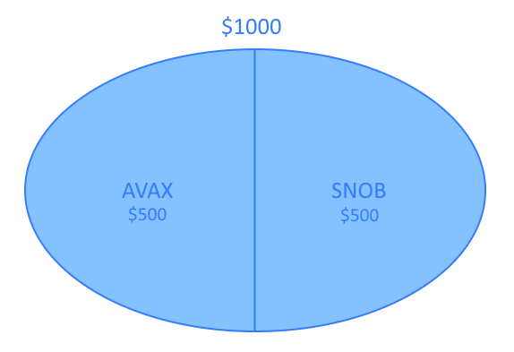
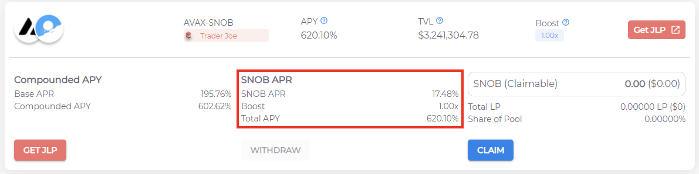

# YF 122 - Liquidity Pools

Liquidity pools are one of the main concepts that has enabled the decentralized exchanging of tokens. They are a great way to contribute to the functionality of a blockchain while getting rewarded for doing so. This course will cover the following:

* Basics of Decentralized Exchanges & Automated Market Makers
* Defining Liquidity Pools
* Understanding Liquidity Pool Functionality
* Reasons to Provide Liquidity
* Risks of Providing Liquidity

#### Suggested Prior Reading:

None.

## Introduction

To understand liquidity pools, we must look at why they are necessary in the first place. Centralized exchanges function with an order book system. There is a buyer and a seller, and both parties deposit their funds into a centralized company's coffers. The centralized exchange's algorithm can then match buyers and sellers together, eventually executing the trade on each party's behalf.

In decentralized finance, we seek ways of eliminating the middle-man, in this case the company executing the trades on behalf of their users. For this to be possible, we substitute the middle man for a smart contract, governed only by its code; unchangeable and verifiable by anyone. Automated Market Makers (AMMs) are a type of decentralized exchange that allow a user to simply swap one token for another, without ever having to deposit funds into a centralized exchange. To do this, however, they require liquidity. That is where liquidity pools come in.

## Liquidity Pools

In a liquidity pool, users provide liquidity for AMMs to be able to function. This means that if someone wants to swap AVAX tokens for SNOB tokens, there would need to be SNOB tokens available for the smart contract to give the user. However, the same needs to be said for a transaction in the opposite direction. Because of this, when providing liquidity, a user must provide at least two tokens to the liquidity pool.

We'll be looking into an example of an AVAX-SNOB liquidity pool, with $1000 in assets deposited. In this example, 50% of the value of the pool ($500) would be in AVAX tokens. The other 50% of the value of the pool ($500) would be in SNOB tokens.

This pool would allow users of a decentralized exchange to swap between tokens easily - they would simply deposit one token and withdraw another. This transaction would be executed by the smart contract.

As users swap tokens around, however, an imbalance in the pool may be created; There may be more value in the pool for one token than the other. This is mostly mitigated through price changes (based on supply and demand) and arbitrage trading.

The number of tokens in each half of the pool may also change due to price changes of one or both tokens. For example, if the price of a token increases, the pool would need less of that token and more of the other token in order to maintain a balance of 50% value in each half.


For a more in-depth review of the math behind calculating token balances at any given time in liquidity pools, check out the YF 423 course on 'LP Math'.


## Providing Liquidity

As a liquidity provider, you will receive Liquidity Pool (LP) tokens in exchange for depositing. These LP tokens represent your percentage share of the pool you have deposited into. If there are 100 LP tokens in circulation, for example, and you have 1 LP token in your wallet, you own 1% of the pool. This percentage is important since, as explained before, token amounts and values may change inside the pool as users utilize it on a decentralized exchange. In this case, your percentage share remains the same. If more people provide liquidity, however, your percentage share of the pool will diminish. For example, if the liquidity in the pool doubles and there are now 200 LP tokens in circulation, you now own 0.5% of the pool.

At any time, you can withdraw your liquidity provided by returning your LP tokens. At this time, the smart contract, in exchange for your LP tokens, will give you your share of the pool back, regardless of its composition. For example, if at the time there are 100 AVAX tokens and 500 SNOB tokens in the pool, a 1% share would net you 1 AVAX and 5 SNOB.

## Economic Incentives

Supporting the ecosystem through providing liquidity is great, but if that was only possible due to people's altruism it would definitely not be sustainable. This is why there are substantial economic incentives in place for people to provide such liquidity.

Every time someone executes a swap through a decentralized exchange, they will pay a small fee in addition to the transaction cost. This fee will be added to that pair's liquidity pool. If you are providing liquidity for that token pair, you own a percentage of that pool. In that case, you just made some money! **The value of your LP tokens will be increasing over time due to this fee revenue.**

Most decentralized exchanges also provide incentives in the form of their own token. For example, Trader Joe has JOE token incentives, while Pangolin has PNG token incentives. These allow users to make profits even at times where transaction volume isn't great on a specific pair.

Furthermore, platforms such as Snowball, offer alongside our compounding strategies extra incentives in the form of our Snowball (SNOB) token:

The trading fees, extra platform incentives and in Snowball's case our auto-compounding features, make providing liquidity a convincingly profitable endeavor. But as with any financial decision, we must consider the risks.


To learn more about the functionality of auto-compounders such as Snowball, check out the YF 261 course on 'Auto-Compounding'.


## What Could Go Wrong

There are two main risks of providing liquidity pools:

* Underlying Token Exposure
* Impermanent Loss

The first is quite straightforward; it is important to keep in mind that by providing liquidity, **you are still exposed to price changes of whatever assets you are depositing.** If the price of such assets increase, great! But as with any volatile assets, prices can go down at any time. As a general rule of thumb, provide liquidity for assets you wanted to hold in the first place, not any token with a 9999%+ LP APY.

The second is more complicated, and involves a loss on sudden large movement in asset prices in a pool, respective to each other. If you'd like to learn more about impermanent loss, the Y322 course "Impermanent Loss" is the place to be.

## Closing Thoughts

Decentralized exchanges and AMMs are a must-have on any successful DeFi ecosystem, and providing liquidity for those to function is of utmost importance. Platforms such as Snowball allow you to make the most of the economic benefits and incentives of providing liquidity, but there are still many risks to consider. Happy yield farming!
