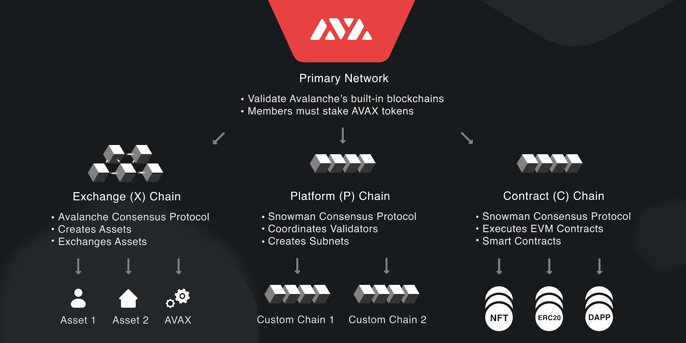

# FN 209 - Avalanche

With so many blockchains being developed, it is important to know exactly why we choose to build within Avalanche, and what makes it unique amongst other chains. This course will briefly cover the following:

* Avalanche's Infrastructure
* AVAX Tokenomics & Utility
* Staking & Consensus Mechanisms
* Scaling Solutions

#### Suggested Prior Reading:


[fn-101-decentralized-finance.md](../1st-year-courses/fn-101-decentralized-finance.md)


## Introduction

While Avalanche mirrors many features and functionality from other blockchains, it is unique in the fact that its primary network (or Mainnet) consists of not one blockchain, but three:

This separation is with the purpose of specializing each chain's infrastructure; making it more suited for efficiently conducting its main purpose. The three chains are secured through the same set of validators, meaning that - as of the time of writing - all three benefit from having 1,300+ validators. This not only means that Avalanche is one of the most decentralized protocols out there, but also one of the most secure.

Let's dive a little deeper into each of the aspects constituting Avalanche, starting with the token that helps bring it all together:

## The AVAX Token

AVAX, the native token of Avalanche, is minted on its X-Chain, and has a hard cap of 720,000,000 tokens. Half of that supply was minted during the chain's genesis block, which allocated vesting schedules for the platform's seed, private and public sales, Ava Labs team, ecosystem grants, Testnet programs and the Avalanche Foundation. The rest of its supply is minted continuously as staking rewards for those validating the network.

The token is utilized as an entry cost of validating the network, as well as to pay for gas fees throughout all its main chains. On Mainnet, all transaction fees paid in AVAX are burned, directly reducing the circulating supply of AVAX. This means that if network usage is high enough, AVAX could turn deflationary and never reach its maximum supply.


For a more in-depth look into transaction/gas fees and why they exist, check our FN 106 course on 'Gas Fees' [**here**](broken-reference).


## Validating Avalanche

Avalanche's Mainnet is essentially a Proof of Stake network, and therefore users must stake tokens in order to To become a validator on Avalanche, you must lock at least 2,000 AVAX for at least 2 weeks on the network's P-Chain. As a validator, you are verifying blocks of transactions submitted to ensure that no invalid or malicious data is submitted on-chain. Users can also delegate to existing validators with a minimum of 25 AVAX, in order to also gain staking rewards, albeit with the validator's fee.

Validators have to adhere to strict parameters if they wish to receive AVAX staking rewards. Other than the minimum requirement of 2,000 AVAX and a 2 week lock, a validator's total weight (accounting for delegations) cannot have more than 3,000,000 AVAX (\~0.4% of AVAX's maximum supply) or 5x their stake; whichever number is smallest. This means that a validator with a stake of 2,000 AVAX can only have 8,000 AVAX delegated to it, for example. A validator's lock can also not exceed 1 year, and their node must be online for at least 80% of their lock period.


Want to know how Avalanche and other networks achieve consensus through their validations? Check out our FN 308 course on 'Consensus Mechanisms' [**here**](broken-reference).


## Avalanche's Scalability

As DeFi expands into broader markets and grants everyday users more utility and freedom, the number of transactions and strain on any given blockchain can be tough to handle. This is why Avalanche, similarly to other platforms, needs a plan to appropriately scale.

Avalanche's solution is subnets - separate networks/chains managed by its P-Chain and validated by a subset of existing Avalanche validators that can be built specifically for a given purpose. While an EVM-compatible chain like the C-Chain is excellent at accomplishing pretty much anything, it is not maximally efficient or a master at any given task.

By creating a specialized subnet for an application, that application can not only be much more efficient, but it can separate itself from the transaction fees' variability of Mainnet, or even choose to use its own token as a gas token.

This abstraction means that as popular dapps migrate to subnets that better suit their needs, the strain on any given network will be independent to each other, leading to not only a more decentralized protocol, but an infinitely scaling one as well.

## Closing Thoughts

Alongside all its technical achievements, Avalanche has also created one of the most welcoming communities in crypto, where people are excited to build new dapps and educate newcomers to the space, be it through Discord servers, Twitter or even conferences like Avalanche Summit. Make sure to talk to others around you also enjoying Avalanche and all it brings, and have a great and safe time exploring your financial freedom!
