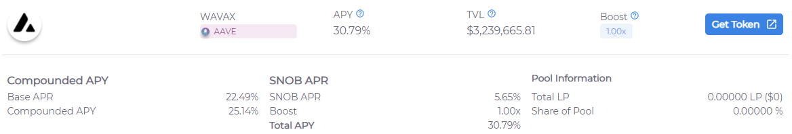
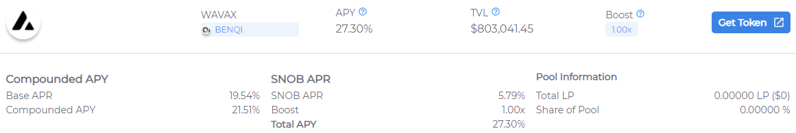
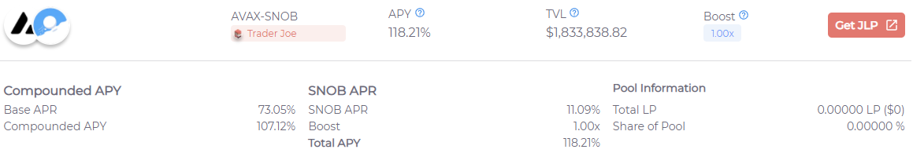
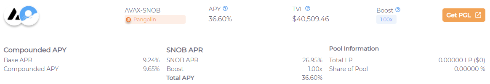

# EX 325 - Single-Asset vs LP Strategies

Snowball offer many auto-compounding single-asset and LP strategies for you to make the most out of your assets. Having trouble deciding between the two types? This is the course for you. It will cover the following:

* Pros/Cons of Single-Asset Strategies
* Pros/Cons of LP Strategies
* Basics of Diversification Principles

#### Suggested Prior Reading:


[yf-111-lending-markets.md](../1st-year-courses/yf-111-lending-markets.md)



[yf-122-liquidity-pools.md](../1st-year-courses/yf-122-liquidity-pools.md)



[yf-312-folding.md](yf-312-folding.md)



[yf-323-impermanent-loss.md](yf-323-impermanent-loss.md)


## Introduction

To begin with, it is important to clarify that whatever strategy you employ to get the best rates for your assets, you must keep in mind your exposure to the assets you are holding. This is because regardless of how good the returns are for a strategy, if you are forced to hold a token you would not usually feel comfortable holding you are taking on a lot of extra risk with your investments. You wouldn't invest your savings into bottle caps if someone offered to double your bottle cap count, for example.

But let's assume you already have all the tokens you want to hold; what would you deposit them in? Single-asset lending strategies? Maybe a liquidity pool that includes two of them? Let's take a look at some simple pros and cons of each type of strategy, and later practice our mock decision-making process with an example portfolio.

## Single-Asset Strategies

Single-asset strategies always involve only one asset as the name suggests, and usually involves lending markets or staking. Strategies that involve staking are some of the simplest and safest strategies out there, as long as the platform you are staking in is verifiably trustworthy. Lending strategies are almost as equally safe, have no risk of liquidations contrary to what some may assume, and when folding is implemented alongside it can earn some extremely attractive yields. To summarize:

#### Pros

* Extremely safe.
* Most liquidity concentrated in battle-tested and highly trusted dapps.
* Can have significantly high yields.
* No impermanent loss risk.
* No liquidation risk.

#### Cons

* No yields from trading fees.
* Folding strategy yields may diminish in certain market conditions.

To clarify the last con; folding strategies are based on the profitability of folding. This means that if an asset is over-borrowed and the price of borrowing rises, the strategy may opt to de-leverage in order to remain profitable. This usually means a significant, albeit temporary, drop in APY for users of such strategy. This can take place when volatility in the market is high, such as when the bull market is in full strength and multiple cryptocurrencies are reaching their all-time-highs.

## LP Strategies

LP strategies involve depositing two or more assets into a liquidity pool, and then staking the resulting LP tokens into a contract to receive some extra rewards. These strategies have some of the highest APYs on Snowball, and come from pools in the two largest DEXs on Avalanche. To summarize:

#### Pros

* Extremely safe.
* Most liquidity concentrated in battle-tested and highly trusted DEXs.
* Can have extremely high APYs.
* No liquidation risk.
* On volatile market conditions, yields can increase due to trading volume and fees.

#### Cons

* Exposed to impermanent loss risk.
* Less control over your exact assets.

The downsides to LP strategies definitely revolve around the potential change of ratios in your underlying assets, resulting in impermanent loss. This is an issue if you really want to keep strict control over the amount of any one asset you have, rather than just caring about the resulting value of your LP tokens.

## Example Portfolio

Let's say you have some AVAX and SNOB in your wallet, and you want to evaluate your options to decide where you want to deposit those. In the context of this course, we'll look at both single-asset strategies and LP strategies.


Keep in mind these examples will take into account the current rates as of 02/11/2021, and will certainly be different in the future. The logic behind the analysis still stands regardless of rates or assets.


#### Single-Asset AVAX Strategies

For the strategies above, the important aspects to consider are the rates being offered, TVL, underlying platform and the composition of the rates you are getting. The rates being offered for these lending and folding strategies are quite similar, including their compositions (both have approximately 5.5-6% of SNOB APR). Because of this, a decision between these two would likely come down to TVL and how battle-tested each of the underlying platforms are.

When it comes to TVL, there is an obvious winner - and while putting your funds where other people have done so isn't always the best strategy, a large TVL is a good indicator of people's trust in a platform's code and history. This is likely due to the fact that while BenQi is an amazing Avalanche-native platform with audited code, Aave has been around for much longer on other blockchains, with an excellent track-record.

#### Single-Asset SNOB Strategies

In terms of single-asset strategies, the best way to allocate your SNOB would be to lock it for xSNOB on Snowball's staking page. As of writing, this results in an approximate 30-40% APY per xSNOB. To learn more about xSNOB, check out our documentation [**here**](https://docs.snowball.network/governance/xsnob).

#### AVAX-SNOB LP Strategies

If you were to consider LP strategies, you'll likely be looking at the two above. To compare the two, we'll be looking at the same characteristics of each strategy as we did for single-asset strategies. The rates offered for these pools can be significantly higher than single-asset strategies, but come with the drawbacks mentioned in the previous section. These strategies at the moment also seem to be offering a larger amount of SNOB APR at 11% and 27% respectively, which if your goal is to accumulate as much SNOB as possible is great.

In terms of TVL, we can see that Trader Joe has acquired the majority of deposits, which could simply be due to the extent of their incentive rewards, or some reflection of people's trust in the platform. An important aspect to note is that since the TVL is relatively low on Pangolin's strategy, you could gain a large portion of the SNOB rewards allocated to that strategy, but the APR will lower as large deposits are made. Of course, you could always vote to allocate more SNOB rewards to that strategy.

#### Making Decisions

Making decisions as to where to allocate your assets will come to analyzing each of the aspects discussed above, along with your risk-assessment strategies and any time-based considerations.

If you are a safe investor that likes to avoid as much risk as possible, you'd likely opt for single-asset strategies for both AVAX and SNOB, or diversify your portfolio into both types of yield-generating strategies; single-asset and LP-based. In the first scenario you would be avoiding impermanent loss entirely, while in the second you would be diminishing the risk of fluctuating rates due to any unexpected market conditions.

Why would you not just deposit all your funds into AVAX-SNOB strategy on Trader Joe, since they have the highest rates right now? Since you are already are and plan on holding both assets, you definitely could. The biggest consideration here is impermanent loss. The 118% rate offered will likely diminish throughout the year, but regardless, let's consider a base rate of 90%; could you potentially experience enough impermanent loss to bring these gains down to below what you would have gained with other strategies? Technically, yes.

This would largely depend on the time you plan on holding the AVAX-SNOB LP token. While the AVAX and SNOB tokens have relatively good price correlation, impermanent loss can still definitely take place, and it can most definitely take place in the short-term. In contrast, the interest rate displayed on the strategy is on an yearly basis. This means that if you only plan on holding these LP tokens for a short period of time, you could even lose money due to impermanent loss. On the medium to long term, however, it is very likely that the interest accrued will largely outperform any losses due to impermanent loss.

## Closing Thoughts

At the end of the day, choosing strategies to allocate your funds to will largely depend on your investment and risk-assessment strategies. Knowing all the risks and having looked at our example scenario will hopefully have highlighted some aspects to consider and aid your decision-making process. Happy farming!
