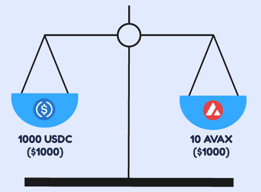
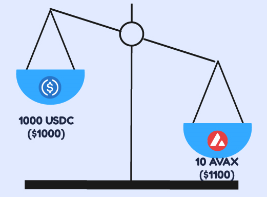
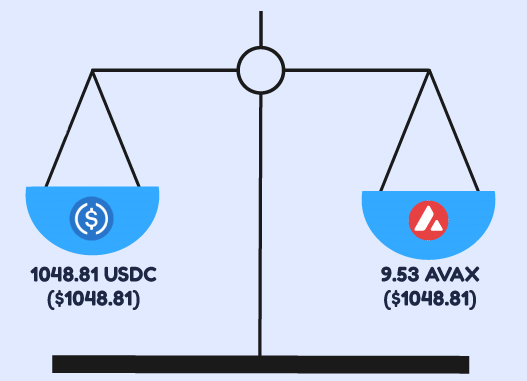
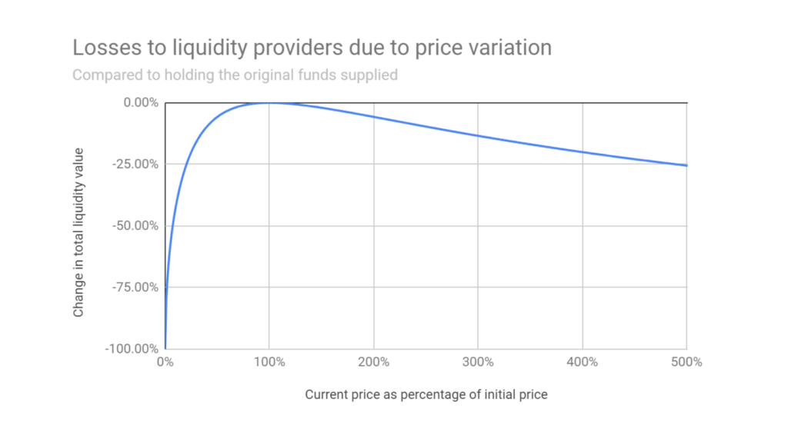
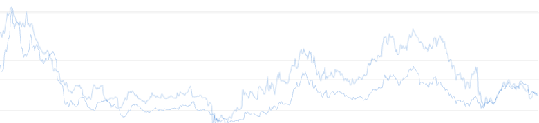

# YF 323 - Impermanent Loss

Impermanent loss is a term that is thrown around quite a bit when it comes to providing liquidity to automated market makers (AMMs) on various decentralized applications. This course will cover the following:

* Defining Impermanent Loss
* Understanding Arbitrage Opportunities
* Protecting Yourself From Impermanent Loss

#### Suggested Prior Reading:


[yf-122-liquidity-pools.md](../1st-year-courses/yf-122-liquidity-pools.md)


## Introduction

Impermanent loss's name can be a bit deceiving. It comes from the fact that as a liquidity provider, your losses will not be realized until the moment you withdraw your funds from a liquidity pool. It should not be glossed over, however, since once you do withdraw your funds the loss is by all means permanent.

The loss itself comes from a comparison between the funds acquired on withdrawal to the funds you would have if you had not deposited those funds in the first place, given a change in asset prices. To demonstrate this in practice, we will look at two people, Bob and Alice, and their approaches to their investments.

## A Tale of Two Investors

Bob and Alice are two investors, each with $1000 worth of USDC tokens, and $1000 worth of AVAX tokens. Alice decides to just hold the tokens in their wallet. Bob, however, deposits their USDC and AVAX tokens into a liquidity pool. While there are other types of liquidity pools out there, we will assume this pool holds 50% of its value in USDC and 50% in AVAX, as is most common. If AVAX's price is $100 (for simplicity's sake), Bob's assets in the pool would look like the following:

As is common in financial markets, let's say the price of AVAX increases by 10%. In this hypothetical scenario, 1 AVAX is now worth $110. Bob's assets in the pool would then look like the following:

The pool's assets in this case are worth more, but the pool is unbalanced; no longer accurately reflecting its 50/50 goal. The mechanism behind the rebalancing of the pool back to its initial state is simple; arbitrage.

## Arbitrage Opportunities

To understand how arbitrage functions in this scenario, it is important to know that token prices in AMMs are not determined by order books like centralized exchanges. **In a liquidity pool, the only variable that indicates a token's price is the ratio of each token.**

In the prior example, since Bob deposited 1000 USDC and 10 AVAX, the pool assumes the price of AVAX is 100 times that of USDC. This means that through the pool, someone can trade 100 USDC for 1 AVAX, and since that will affect the pool's ratio of tokens, their assumed prices will be affected as well.

This also means that an arbitrage trader or bot is able to purchase AVAX at a 10% discount in comparison to other markets, given the state of the pool from the previous image (where 1 AVAX is worth $110). As this arbitrage takes place, USDC is deposited into the pool, and AVAX is withdrawn from the pool, until the value ratio of the pool returns to its ideal ratio of 50% for each token. This would result in the following:

Now that the pool is rebalanced, it accurately reflects the prices of USDC and AVAX for swapping. But in this process, arbitrage traders or bots made some profit off of their discounted prices, and money doesn't just pop out of thin air. Let's take a look at our two investor's assets:

Alice still has 1000 USDC and 10 AVAX; now worth $2100 in total.

If Bob were to withdraw their funds from the liquidity pool, the 1048.81 USDC and 9.53 AVAX would now be worth $2097.62. **Bob has experienced an impermanent loss of -$2.38.** Of course this doesn't take into consideration any profit Bob has made in trading fees or rewards while providing liquidity to the pool, which Alice would have missed out on.


If you're looking for a more in-depth explanation of the math behind LP and impermanent loss calculations, check out the YF 424 course on 'LP Math'.


## Mitigation Strategies

The more volatility each asset has in comparison to the other asset(s) in the pool, the more exposure you have to impermanent loss. An estimation of expected impermanent loss can be seen in the following chart:

Knowing this can lead to some possible solutions to mitigate such exposure. For example, since impermanent loss derives from the volatility of an asset, couldn't you just provide liquidity to a pool with non-volatile assets? Well, yes, you could. **A liquidity pool consisting of stablecoins, for example, would only be susceptible to a negligible amount of impermanent loss.** An example of this kind of pool is Snowball's very own StableVault pool. Since it is comprised of only stablecoins, unless one of them lost its peg and increased or decreased drastically in price, the chance of any impermanent loss is extremely low.

While relying solely on stablecoins can be very safe, it does severely limit the number of options you have when choosing which tokens you would like to hold and invest. Especially since many might want to hold tokens that might have a lot of upside potential, for countless reasons. In that case, there is another way of mitigating your exposure to impermanent loss while providing liquidity.

**By selecting two or more assets that are highly correlated in price, you can greatly reduce your impermanent loss risk.** This is because if both tokens' price increases by 10%, for example, there is no impermanent loss. In such a scenario, the ratio between the two tokens in a liquidity pool would have remained the same.

In the image above, for example, we can see that the SNOB and PNG tokens seem highly correlated. Why? Well, both are tokens on Avalanche, both are used as incentives for their protocol, Snowball utilizes many of Pangolin's pools for our auto-compounding strategies, and so on. Finding a sufficiently correlated pair of tokens is not easy, and does not by any means guarantee they will remain correlated in the future. Even so, it can be a viable strategy to avoid impermanent loss.

## Closing Thoughts

At the end of the day, impermanent loss should be considered when choosing a liquidity pool to deposit into, and especially when withdrawing. However, selecting a pool where the trading fees and rewards over time will drastically outweigh the potential risk of impermanent loss would be ideal. As always, managing risk is the most important skill in making financial decisions, and we hope this course has equipped you with some more knowledge to aid in that decision process.
