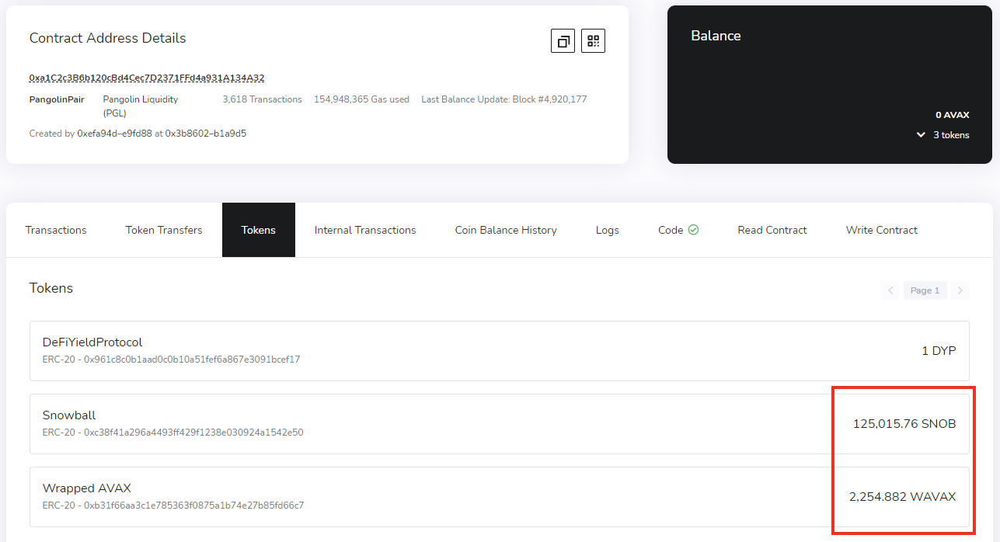

# YF 424 - LP Math

The math around liquidity pools can be a bit confusing, but nonetheless very insightful. This course will shed a light on the equations that govern these pools and will cover the following:

* Constant Product Formula
* Calculating Fee Revenue
* Calculating Impermanent Loss

#### Suggested Prior Reading:


[yf-122-liquidity-pools.md](../1st-year-courses/yf-122-liquidity-pools.md)



[yf-323-impermanent-loss.md](../3rd-year-courses/yf-323-impermanent-loss.md)


## Introduction

There are many different types of liquidity pools, but by far the most common are pools with two tokens, of a 1:1 ratio (50/50) in total pool value. This course will explore these pools. The equations demonstrated in this course are applicable to other types of pools, but would require some modifications.

## Constant Product

The main equation that governs the balancing of tokens in a liquidity pool is the constant product formula:

$$
x * y = k
$$

Simple enough. In this equation, `x` refers to the amount of the first token in the pool, and `y` refers to the amount of the other token in pool. Finally, `k` is the pool's constant product. Let's use the AVAX-SNOB pool on Pangolin as an example:

As can be seen on the pool's [**contract**](https://snowtrace.io/address/0xa1C2c3B6b120cBd4Cec7D2371FFd4a931A134A32), there are approximately 2255 AVAX tokens and 125,016 SNOB tokens in it. This means we can calculate the pool's current `k` value:

$$
\text{2,255} * \text{125,016} = \text{281,911,080}
$$

This value, while not very useful on its own, can help calculate the pool's balances based on certain events. The relevant events that can take place in a liquidity pool are the following:

* Others deposit into the liquidity pool
* Fees are collected from swaps
* A change in price of one of the tokens in the pool

When others deposit into the pool, the value of `k` would increase since there are more tokens in the pool, but your percentage share of the pool would decrease proportionally. Therefore, other than receiving a smaller percentage of trading fees over time, your LP position would not be majorly affected.

In the case of trading fees being collected into the pool, since there are also more tokens in the pool, the value of `k` would increase. However, since there are still the same amount of LP tokens in circulation, your share of the pool is unaffected. This means your LP tokens are now worth more. For example, if you owned 0.5% of the pool:

$$
\frac{\text{2,255}} {100} * 0.5 = 11.275 \text{ AVAX} \text{, } \frac{\text{125,016}} {100} * 0.5 = 625.08 \text{ SNOB}
$$

However, let's say over the span of a week 25 AVAX and 1386 SNOB were collected as fees into the pool:

$$
\frac{\text{2,280}} {100} * 0.5 = 11.4 \text{ AVAX} \text{, } \frac{\text{126,402}} {100} * 0.5 = 632.01 \text{ SNOB}
$$

This would result in a profit of 0.125 AVAX and 6.93 SNOB for you. This is assuming there were no deposits into or withdrawals from the pool in terms of liquidity, or any asset price changes.

These first two events are quite self-explanatory, and do not require a lot of calculations. Where it does start getting a little messy is when price changes come into play.

## Price Changes

The important value to keep in mind when considering asset price changes is the ratio between the two tokens in the pool. In our starting example:

$$
\frac{\text{125,016}} {\text{2,255}} \approx 55.44
$$

In practice, this means 1 AVAX is equal to 55.44 SNOB. As calculated beforehand, if you owned 0.5% of the pool, you have 11.275 AVAX and 625.08 SNOB.

However, let's say that the price of SNOB tokens doubles by next week. AVAX prices remain the same. 1 AVAX would be equal to 27.72 SNOB. In order to calculate the new pool balances based on this price change, we need a few new equations:

$$
x_t = \sqrt{\frac{k} {r_t}}, y_t = \sqrt{{k * r_t}}
$$

In the equations above, `x` and `y` are the token balances at any given time. `k` is the product constant that we calculated beforehand. `r` refers to the ratio of tokens at any given time. We can test these equations with our original values prior to the price change:

$$
x_t = \sqrt{\frac{\text{281,911,080}} {55.44}} \approx \text{2,255}, y_t = \sqrt{{\text{281,911,080} * 55.44}} \approx \text{125,016}
$$

And similarly, calculate the new balances after the price change using the new ratio:

$$
x_t = \sqrt{\frac{\text{281,911,080}} {27.72}} \approx \text{3,189}, y_t = \sqrt{{\text{281,911,080} * 27.72}} \approx \text{88,400}
$$

If you owned 0.5% of the pool, previously you would have had 11.275 AVAX and 625.08 SNOB. After the price change, you would now have:

$$
\frac{\text{3,189}} {100} * 0.5 = 15.945 \text{ AVAX} \text{, } \frac{\text{88,400}} {100} * 0.5 = 442 \text{ SNOB}
$$

## Impermanent Loss

Since we have the pool's token balances at any given time based on it's token ratio, we can also calculate the impermanent loss for any price change. We can convert the token balances to one token for easier calculations. For example, prior to the price change:

$$
\text{2,255} + \frac{\text{125,016}} {55.44} = \text{4,510 AVAX}
$$

And similarly, after the SNOB token's price change:

$$
\text{3,189} + \frac{\text{88,400}} {27.72} = \text{6,378 AVAX}
$$

If you owned 0.5% of the pool, you would have gone from having the equivalent of 22.55 AVAX to having the equivalent of 31.89 AVAX. That is a 41.42% increase in value, or a profit of 9.34 AVAX. Since the value of SNOB doubled, wouldn't you expect a 50% increase in value? The value of your original deposit prior to the price change, if you hadn't provided liquidity, would be the following:

$$
11.275 + \frac{625.08} {27.72} \approx 33.82 \text{ AVAX}
$$

This would be a 50% increase in value, as expected. To calculate the impermanent loss of such an event, we can use the following equation:

$$
\text{IL} = \frac{value_{lp}} {value_{hold}} - 1
$$

$$
\text{IL} = \frac{31.89} {33.82} - 1 \approx -0.057 = \text{-5.7%}
$$

**This means that a 100% change in price of one token in comparison to the other paired token will result in an impermanent loss of approximately -5.7%.** Of course, if AVAX prices in this example also climb in at the same rate, impermanent loss will be null. The same is true for the same percentages to the downside, as well.

## Closing Thoughts

With these equations, you can more accurately predict the impact of trading fee revenue, price changes and impermanent loss on your LP positions. With this information you can hopefully make better decisions as to what pools you would like to invest in, and what risks you are willing to take in your positions.
