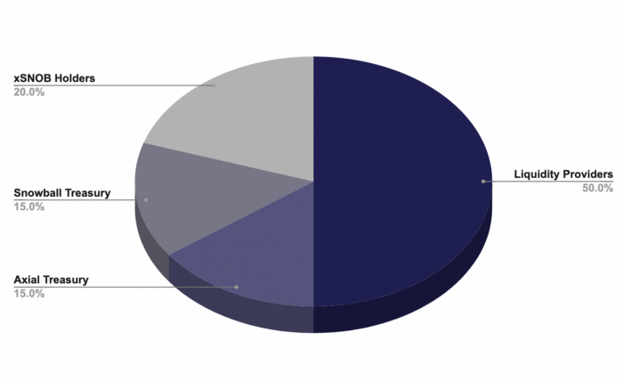
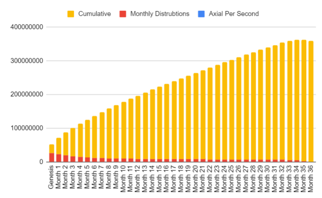

# AXIAL

The AXIAL token is Axial's governance token, and 50% of its supply is used as incentives for those providing liquidity in our many liquidity pools.

Ticker: AXIAL

Max Supply: 365,000,000

Token Address: [0xcF8419A615c57511807236751c0AF38Db4ba3351](https://snowtrace.io/token/0xcF8419A615c57511807236751c0AF38Db4ba3351)

Chain: Avalanche C-Chain

## Token Distribution

## Emission Schedule

There is a total supply of 365 million AXIAL tokens. These tokens are currently being emitted as liquidity incentives in our various pools.

## Earning AXIAL

AXIAL is earned by providing liquidity on Axial's many liquidity pools, as well as participating in governance through Snowball's staking of SNOB tokens.

The AXIAL token can also be purchased on exchanges:

* [**Pangolin**](https://info.pangolin.exchange/#/token/0xcF8419A615c57511807236751c0AF38Db4ba3351)
* [**Trader Joe**](https://analytics.traderjoexyz.com/tokens/0xcF8419A615c57511807236751c0AF38Db4ba3351)

## AXIAL Resources


[general-faq.md](../resources/frequently-asked-questions/general-faq.md)



[smart-contracts.md](../resources/smart-contracts.md)

