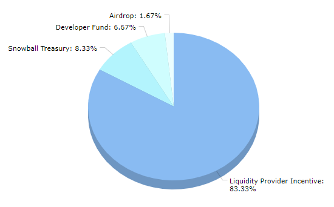

# AXIAL

The SNOB token is Snowball’s governance token. It can be locked for xSNOB to vote on proposals, vote on weekly SNOB allocations, earn a portion of protocol revenue, and earn boosted SNOB rewards.

Ticker: SNOB

Max Supply: 18,000,000

Token Address: [0xC38f41A296A4493Ff429F1238e030924A1542e50](https://snowtrace.io/token/0xC38f41A296A4493Ff429F1238e030924A1542e50)

Chain: Avalanche C-Chain

## **Token Distribution**

## **Emission Schedule**

There is a total supply of 18 million SNOB tokens. These tokens are currently being emitted through Snowball's products as incentive rewards.

The following table shows an updated representation of SNOB emissions based on governance proposal 12, which made SNOB emissions decline gradually over time.

|    Block   | SNOB /block |
| :--------: | :---------: |
|  3,065,000 |     0.5     |
|  3,515,000 |     0.47    |
|  3,965,000 |     0.44    |
|  4,415,000 |     0.41    |
|  4,865,000 |     0.38    |
|  5,315,000 |     0.35    |
|  5,765,000 |     0.32    |
|  6,215,000 |     0.29    |
|  6,665,000 |     0.26    |
|  7,115,000 |     0.23    |
|  7,565,000 |     0.2     |
|  8,015,000 |     0.17    |
|  8,465,000 |     0.14    |
|  8,915,000 |     0.11    |
|  9,365,000 |     0.08    |
|  9,815,000 |     0.05    |
| 10,265,000 |     0.02    |
| 10,715,000 |      0      |

**Total SNOB Emissions:** 1,989,000 SNOB

## **How to earn SNOB**

SNOB is earned by using Snowball’s products. When you deposit into a product on Snowball, you receive a receipt token that can be deposited again to earn SNOB.

The amount of SNOB you get for depositing in each product varies weekly and is determined by Snowball’s gauges. View this week’s SNOB distribution on the [**xSNOB**](https://app.snowball.network/staking) page of our website.

SNOB can also be purchased on exchanges. [**Pangolin**](https://info.pangolin.exchange/#/token/0xc38f41a296a4493ff429f1238e030924a1542e50) and [**Trader Joe**](https://analytics.traderjoexyz.com/tokens/0xc38f41a296a4493ff429f1238e030924a1542e50) both support the SNOB token.

## **SNOB Resources**


[Broken link](broken-reference)



[general-faq.md](../resources/frequently-asked-questions/general-faq.md)



[smart-contracts.md](../resources/smart-contracts.md)

